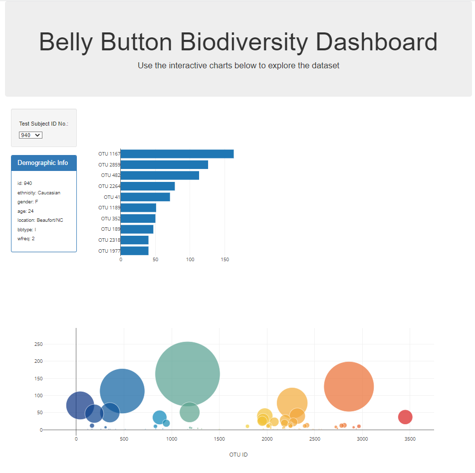

# Interactive dashboard on belly button biodiversity

## **Overview**
Built an interactive dashboard to explore the [belly button biodiversity data set](http://robdunnlab.com/projects/belly-button-biodiversity/) that catalogues the microbes that colonise human bully buttons!

## **Visualisation**

## **Folder sturcture**
- The main folder contains the html code *index.html*
- The folder *static* contains the dashboard code *app.js* 
- The app has been deployed to Github Pages, which can be accessed via this [link](https://kimco2.github.io/belly-button-challenge/)

 

---

### **Contact**
Email: kymcoleman@gmail.com

---
